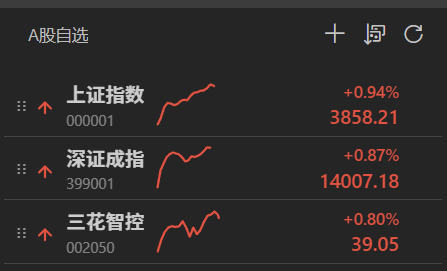
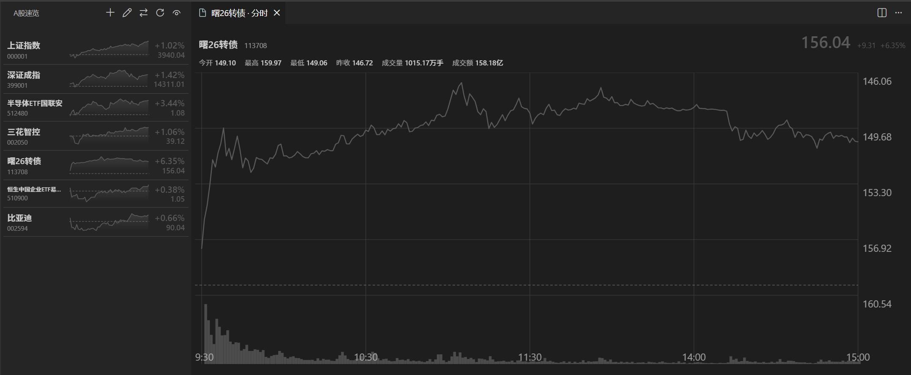

# A股速览


在 VS Code 侧边栏实时查看 A 股自选股行情，支持分时迷你走势图、置顶、右键快捷操作与排序。




老板模式（`Ctrl+Alt+L`）一键灰显界面：



## 安装

VS Code 扩展市场搜索「A股速览」，或访问插件主页直接安装：

[A股速览 - Visual Studio Marketplace](https://marketplace.visualstudio.com/items?itemName=wsyqn6.a-stock-watch)

## 特性

- **实时行情**：自选股价格、涨跌额、涨跌幅，涨跌红绿区分
- **分时迷你图**：卡片内嵌当日分时走势迷你图
- **分时详情图**：点击自选股行，在编辑器面板打开雪球风格分时大图（分时线 / 均价线 / 成交量柱 / 十字光标）
- **老板模式**：`Ctrl+Alt+L` 一键灰显全部界面，低调不显眼，随时退出
- **置顶自选股**：一键置顶，始终显示在最前，切换排序方式也不打扰
- **右键快捷操作**：行上右键即可 切换状态栏 / 置顶 / 复制代码 / 删除
- **状态栏报价**：最多 3 只自选股常驻状态栏，随时可见
- **编辑模式**：拖拽手动排序、删除、置顶、状态栏切换一步到位
- **快速添加**：搜索代码 / 拼音缩写 / 名称，或直接输入 6 位代码
- **灵活排序**：拖拽手动排序，或按代码 / 名称 / 涨跌幅自动排序
- **设置持久化**：自选股、置顶、状态栏均保存在用户设置中，重启不丢失

## 轻量 · 简洁 · 高效 · 开源 

本扩展刻意追求轻量，不占资源、不干扰工作：

- **完全开源 · MIT**：源码全部公开在 [GitHub](https://github.com/wsyqn6/a-stock-watch)，零闭源组件，可自由使用 / 修改 / 分发（含商用）
- **零框架依赖**：原生 WebView + 原生 TS，无任何运行时依赖，加载即用
- **单一职责**：只专注自选股行情，界面克制，不做功能堆砌
- **低资源占用**：无后台进程、无常驻子进程，侧边栏隐藏即完全零开销
- **只在交易时段请求**：休市、午休与节假日自动跳过，不空转
- **批量请求**：全部自选股合并为单次 HTTP 请求，随数量增加不放大请求量
- **防并发**：内置请求去重，避免轮询堆积
- **数据缓存**：分时数据带缓存，重复展示不重复拉取
- **高效实现**：TypeScript 强类型 + 纯函数分层，代码精简可测试

## 使用

侧边栏「A股速览」图标打开面板。标题栏按钮：

| 按钮 | 命令 | 说明 |
| --- | --- | --- |
| ➕ | 添加自选股 | 搜索或输入 6 位代码 |
| ✎ | 编辑自选股 | 切换编辑模式，拖拽排序 / 删除 / 置顶 |
| ↕ | 排序自选股 | 手动 / 代码 / 名称 / 涨跌幅 |
| 🔄 | 刷新行情 | 立即刷新 |

卡片操作：

- **右键**：弹出快捷菜单 —— 添加/移出状态栏、置顶/取消置顶、复制代码、删除
- **编辑模式**（✎）：拖动卡片调整顺序，点 ✕ 删除，点图钉置顶，点心形切换状态栏
- **置顶**：置顶股始终显示在最前，组内仍按当前排序方式排列

## 设置

| 设置项 | 默认 | 说明 |
| --- | --- | --- |
| `aStockWatch.refreshIntervalSec` | `3` | 行情刷新间隔（秒），范围 1–120 |
| `aStockWatch.watchlist` | `[]` | 自选股列表，数组顺序即显示顺序（可手动编辑） |
| `aStockWatch.pinned` | `[]` | 置顶自选股，始终显示在最前（须为自选股成员） |
| `aStockWatch.statusBar` | `[]` | 状态栏显示的股票代码，最多 3 只（须为自选股成员） |

> 首次使用会写入默认自选股（上证指数、深证成指）。

## 数据来源

行情与分时数据来自腾讯行情公开接口，数据仅供参考，不构成任何投资建议。

## 开发

```sh
bun install       # 安装依赖
bun run compile   # 编译 TS -> out/
bun test          # 运行测试
bun run package   # 打包 .vsix
```

## 安装

VS Code 扩展市场搜索「A股速览」，或访问插件主页直接安装：

[A股速览 - Visual Studio Marketplace](https://marketplace.visualstudio.com/items?itemName=wsyqn6.a-stock-watch)

## License

[MIT](LICENSE)
